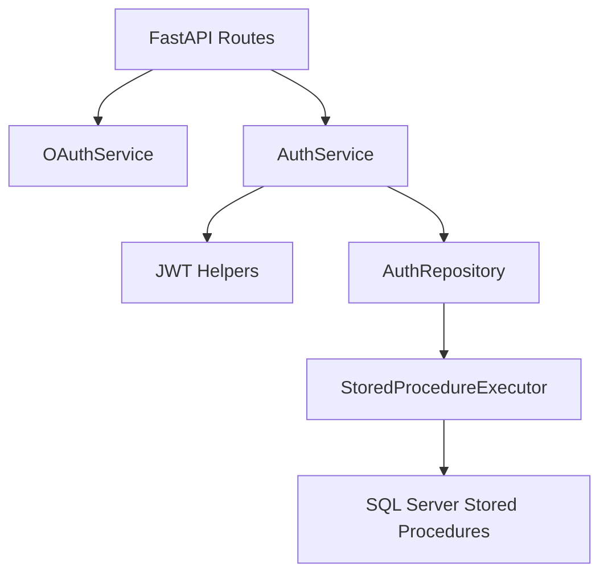

# ADR: Authentication Module

## Status

Accepted

## Context

The backend follows a database-centric architecture. FastAPI handles HTTP, OAuth communication, JWT issuance, validation, serialization, logging, and stored-procedure calls. SQL Server owns business logic, user lifecycle decisions, and provisioning rules.

## Decision

Authentication is implemented as a thin orchestration module:

- OAuth providers are handled by `OAuthService`.
- OAuth state is HMAC-signed, timestamped, stored in an HttpOnly cookie, and validated before token exchange.
- JWT signing and validation reuse `app.core.security`.
- Request identity is resolved through FastAPI dependencies.
- Database integration is limited to repository methods backed by stored procedures.
- OAuth registration and database provisioning are delegated to SQL Server procedures.
- Local credential endpoints are not exposed until SQL Server credential procedures exist.

## Consequences

The API does not duplicate user creation, existence checks, provisioning, or credential rules. Provider-specific payloads are normalized before they reach the service boundary, and database errors are sanitized before HTTP responses.

## Diagram

