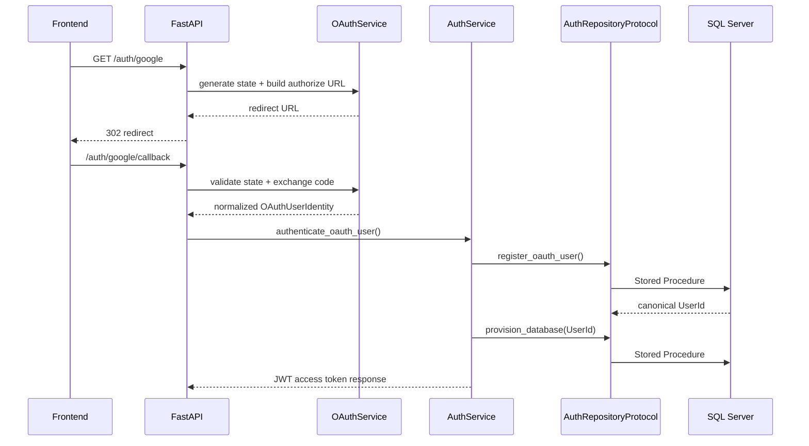

# Authentication Architecture

## Purpose

This document explains why the authentication foundation is structured as a thin orchestration layer and how its components interact.

## Responsibilities by Module

### `app/auth/services/auth_service.py`

`AuthService` is responsible for orchestration only. It receives normalized identity data, delegates OAuth identity registration and provisioning to the repository boundary, and issues JWTs using the existing security helper. It does not decide whether a user exists or whether a database must be provisioned.

### `app/auth/services/oauth_service.py`

`OAuthService` owns the provider-specific exchange workflow. It builds authorization URLs, validates signed state, performs token exchange, and normalizes provider payloads into `OAuthUserIdentity`.

### `app/auth/dependencies/auth_dependencies.py`

The dependency layer extracts the current bearer token and resolves the authenticated request identity. This keeps route handlers ignorant of JWT internals and reinforces the separation between transport and security.

### `app/auth/repositories/auth_repository.py`

The repository adapter is the contract boundary for Stored Procedure orchestration. It keeps SQL Server as the source of truth and avoids letting FastAPI become a business-rule engine.

## Why this architecture

The design intentionally avoids embedding business logic in the API layer. This reduces the likelihood of conflicting validation rules, keeps authorization decisions in the database, and makes the system easier to reason about under production constraints.

## Sequence diagram

## Extension Points

- add more providers by reusing the normalized DTO
- add refresh-token support without changing repository contracts
- extend repository interfaces only when stored-procedure behavior becomes available

## Architectural Principles

- thin API layer
- repository-centered data delegation
- typed DTO boundaries
- no provider logic leakage beyond the OAuth service
