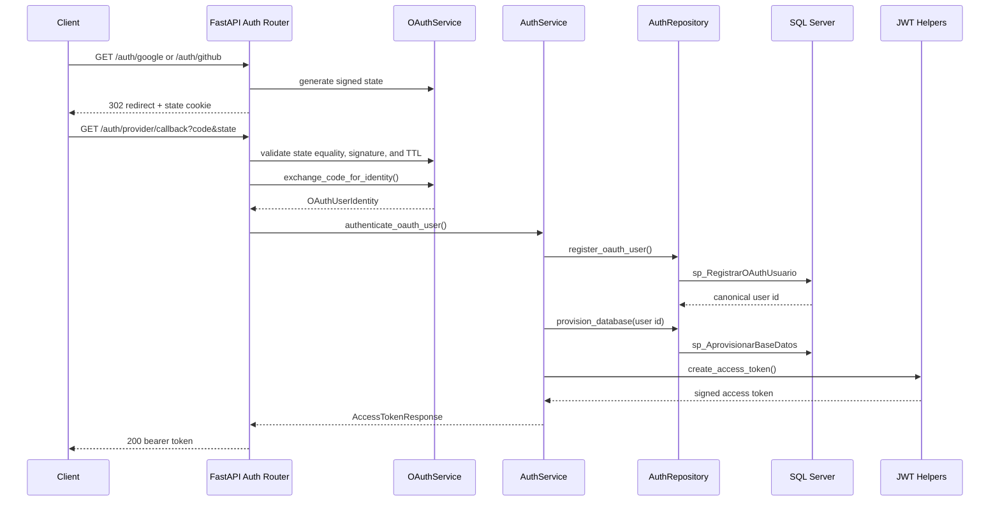

# Authentication Flow

## End-to-End Flow

## Authorization Flow

Protected endpoints use `get_current_token()`, `get_current_subject()`, or `get_current_user()`. These dependencies validate the bearer token with `decode_access_token()` and return typed request context. Business authorization still belongs in SQL Server-backed procedures or explicit route-level policy dependencies.
