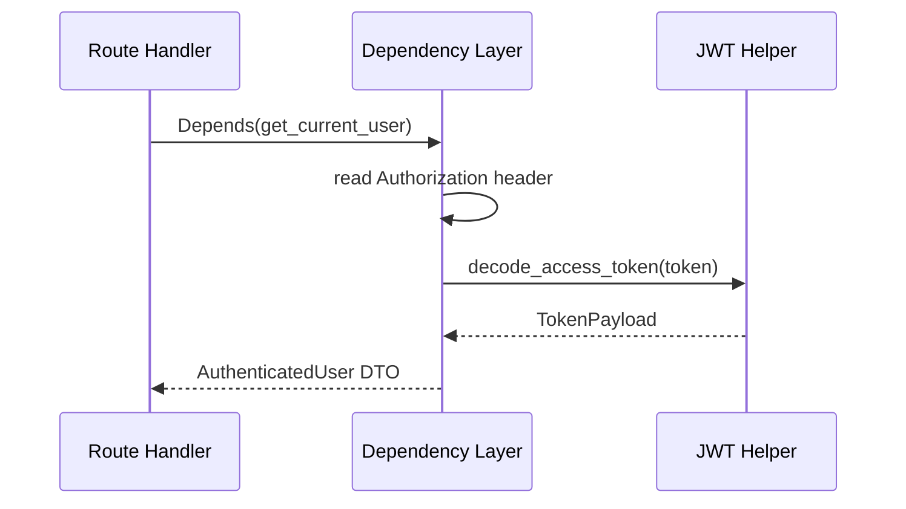

# Authentication Dependencies

## Purpose

This document explains the dependency boundary that resolves the current authenticated user and keeps request handlers free from authentication internals.

## Responsibilities

The dependency layer is responsible for:

- reading the bearer token from the request
- validating the token through the existing JWT decoder
- returning a typed current-user context
- keeping route handlers focused on request handling rather than token parsing

## Dependency Flow

- `get_current_token()` extracts the bearer token
- `get_current_subject()` validates the token and returns the claim subject
- `get_current_user()` returns `AuthenticatedUser`
- `get_current_user_context()` reduces that payload to the minimal `CurrentUser` context

## Why this boundary exists

The dependency layer prevents JWT parsing logic from leaking into endpoint functions. It also makes the system easier to test and keeps the auth model consistent across all request surfaces.

## Sequence diagram

## Security Decisions

- the dependency layer rejects missing or malformed headers
- invalid tokens become controlled 401 responses
- the dependency boundary does not expose raw token secrets or provider credentials

## Future Extension Points

This dependency layer can later support scoped authorization claims and policy-bound current-user contexts without changing the core JWT/security contract.
