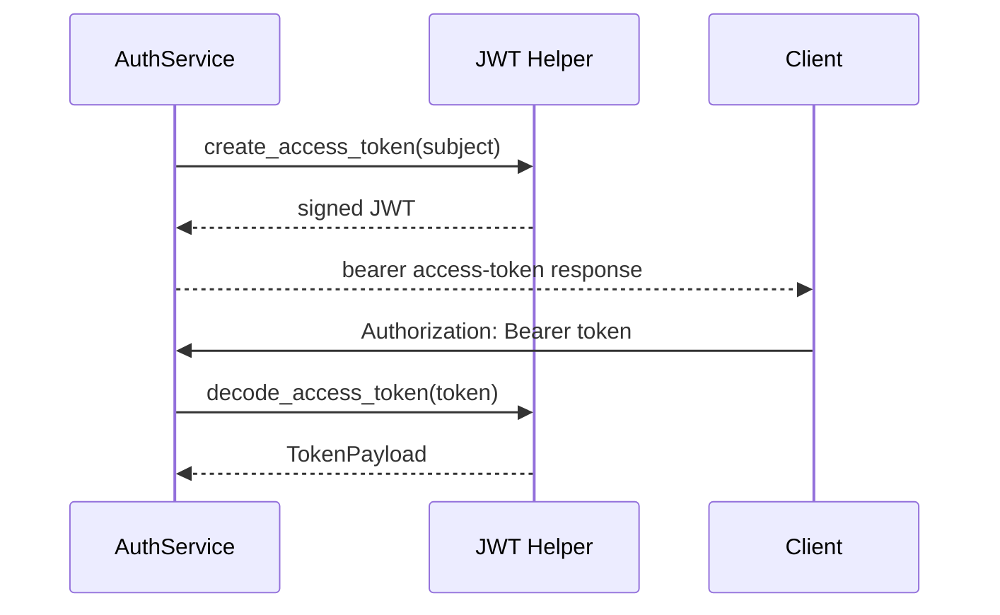

# JWT Design

## Purpose

This document explains why the project uses the existing JWT helper layer and why it is intentionally kept minimal and centralized.

## Responsibilities

The JWT layer is responsible for:

- signing access tokens with the configured secret and algorithm
- validating token payload integrity
- returning a typed `TokenPayload` DTO for the rest of the application

The JWT layer is not responsible for:

- business authorization decisions
- user lookup logic
- session persistence
- database credential generation

## Why the design is centralized

A single JWT utility keeps signing, expiration, and payload validation consistent across all authentication flows. Reusing the existing implementation avoids drift, reduces the chance of a security regression, and prevents accidental divergence between token generation and token decoding.

## Dependencies

- `app.core.security.create_access_token()`
- `app.core.security.decode_access_token()`
- `app.core.config.settings.jwt`
- `app.core.schemas.token.TokenPayload`

## Sequence diagram

## Security Decisions

- the system uses the configured secret key only through the existing security module
- token claims are validated through the typed `TokenPayload` boundary
- reserved claims remain protected from accidental override
- the JWT layer does not expose token contents to the frontend

## Future Extension Points

If refresh tokens, session rotation, or token revocation are introduced later, they should be added as a thin extension of the existing security boundary rather than by creating a parallel JWT implementation.
