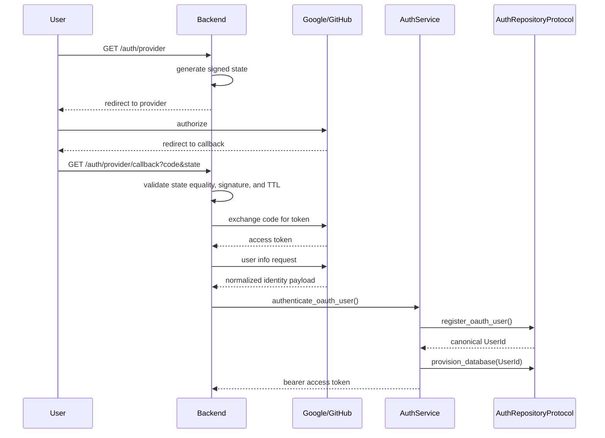

# OAuth Flow

## Purpose

This document explains the externally visible Google and GitHub authorization flow and why it is designed around provider state validation, a normalized identity contract, and a repository boundary.

## End-to-End Flow

1. The frontend begins the flow by calling `/auth/google` or `/auth/github`.
2. The backend generates a cryptographically random, provider-bound HMAC-signed state token.
3. The backend redirects the client to the provider authorize endpoint.
4. The provider redirects the browser back to the callback endpoint.
5. The backend validates state equality, signature, and TTL against the cookie value.
6. The backend exchanges the callback code for a provider access token.
7. The backend fetches the provider user profile and, for GitHub, the verified primary email when the public profile omits email.
8. The backend normalizes the provider payload into `OAuthUserIdentity`.
9. The backend delegates identity registration to `AuthService`.
10. The repository boundary invokes SQL Server Stored Procedures for registration and provisioning.
11. SQL Server owns user creation, existence checks, and provisioning decisions.
12. The backend mints a JWT for the canonical subject returned by SQL Server.

## Why State Validation Matters

State validation prevents CSRF and replay-style tampering. Because the callback is initiated by the user’s browser and not by a trusted server-to-server channel, every callback must be tied to a per-request state value generated by the backend.

## Provider Normalization

Both Google and GitHub are normalized into a common schema so the business and repository boundaries do not become provider-specific. This keeps the rest of the system independent from provider quirks.

## Sequence diagram

## Security Decisions

- the state token is generated with a cryptographically secure random source
- the state token is signed with the configured JWT secret
- the state token is stored in an HttpOnly cookie
- the callback must match the stored state and pass signature/TTL validation or the request is rejected
- provider errors are surfaced as generic HTTP failures, not stack traces
- credentials and secrets are never exposed in the response body

## Future Extension Points

The provider normalization contract allows future additions without changing the repository or JWT boundary. This makes provider onboarding predictable and low-risk.
