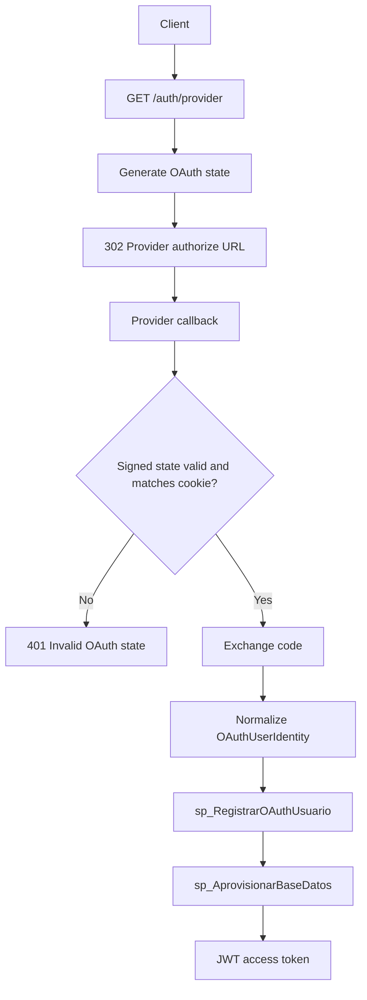

# OAuth Authentication

Google and GitHub OAuth are the only interactive authentication mechanisms currently exposed by the backend. Local username/password login and registration are intentionally absent because this service does not store passwords or decide account creation rules in Python.

## Provider Flow

- `GET /auth/google` and `GET /auth/github` generate a signed, time-bounded state value and redirect to the provider.
- The state value is stored in an HttpOnly cookie with configurable `Secure`, `SameSite`, and TTL attributes.
- Callback endpoints validate state, exchange the authorization code, fetch provider user information, and normalize the result into `OAuthUserIdentity`.
- GitHub profiles can omit public email. When that occurs, the service calls the GitHub emails endpoint and selects the verified primary email if one exists.
- `AuthService` passes the normalized identity to the repository.
- SQL Server Stored Procedures decide registration, existing user handling, and provisioning.
- The backend issues a JWT for the canonical user id returned by SQL Server.

## Mermaid

## Local Credentials

`POST /auth/login` and `POST /auth/register` are intentionally absent because the current architecture replaces traditional credentials with OAuth provider authentication. Adding password login later requires stored procedures for credential validation, lockout, hashing policy, and registration; none of those rules may live in FastAPI.

## Configuration

- `GOOGLE_CLIENT_ID`, `GOOGLE_CLIENT_SECRET`, and `GOOGLE_REDIRECT_URI`
- `GITHUB_CLIENT_ID`, `GITHUB_CLIENT_SECRET`, `GITHUB_REDIRECT_URI`, and `GITHUB_EMAILS_URL`
- `OAUTH_STATE_COOKIE_SECURE`, `OAUTH_STATE_COOKIE_SAMESITE`, and `OAUTH_STATE_TTL_SECONDS`

Production deployments should keep `OAUTH_STATE_COOKIE_SECURE=true` and use HTTPS callback URLs.
