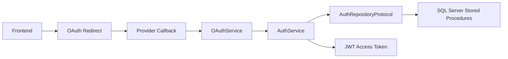

# Authentication Overview

## Purpose

The authentication layer provides the production-ready foundation for token-based identity handling in a database-centric backend. It is intentionally thin and keeps business decisions inside SQL Server Stored Procedures. FastAPI is used only for transport, protocol orchestration, validation, and response shaping.

## Responsibilities

The authentication foundation is responsible for:

- issuing and validating JWTs
- orchestrating OAuth provider handshakes
- normalizing provider payloads into a single user identity contract
- exposing request-scoped dependencies for authenticated users
- delegating database-backed identity and provisioning execution to repository interfaces

The layer is not responsible for:

- business logic
- password creation or storage
- user existence decisions
- authorization policy enforcement
- direct SQL execution in the API layer

## Architectural Decision

This design keeps the API boundary free from business rules. The database remains the source of truth, and the backend coordinates the protocol flow. This separation is important because it prevents duplicate validation logic, reduces the risk of privilege drift, and keeps the FastAPI surface easy to reason about.

## Security Decision

The foundation is designed around fail-secure behavior and least privilege. Tokens are treated as bearer credentials, provider state is signed and validated to prevent CSRF, and all provider-specific responses are normalized before entering the service layer.

## Dependency Map

- FastAPI handles HTTP and routing
- `AuthService` orchestrates the flow
- `OAuthService` performs provider-specific OAuth coordination
- `AuthRepositoryProtocol` defines the stored-procedure boundary
- `decode_access_token()` and `create_access_token()` remain the only JWT utilities reused by the auth layer

## Future Extension Points

The existing package structure already supports:

- additional identity providers
- future token revocation flows
- stronger session or refresh-token integration
- provider-specific repository adapters

## Mermaid

