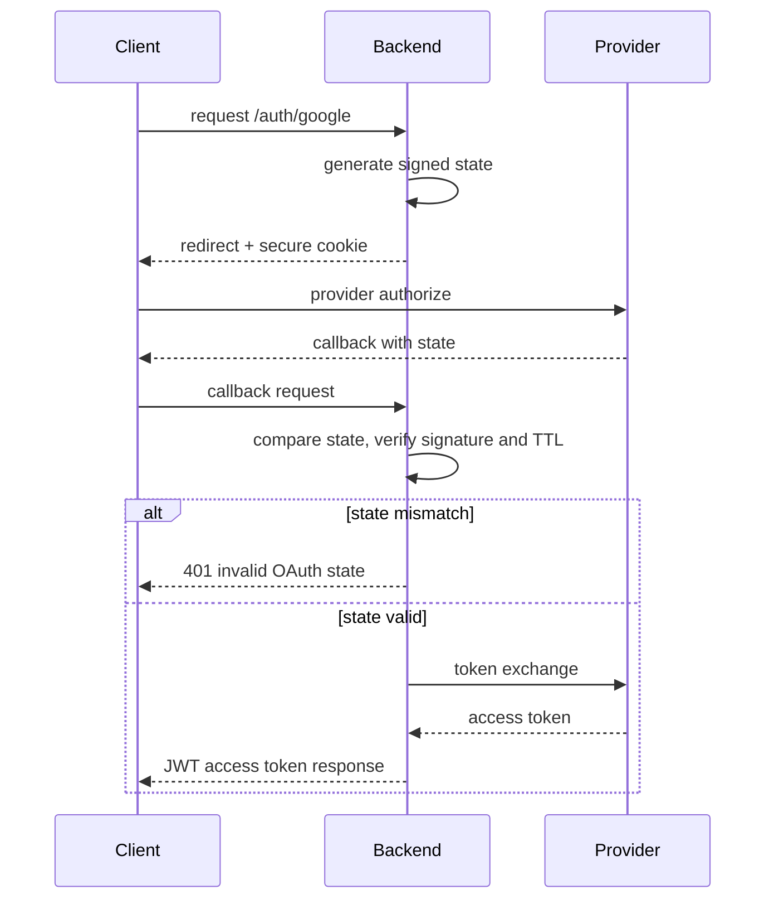

# Authentication Security

## Purpose

This document records the security decisions that shape the authentication foundation. It is meant for future maintainers who need to understand the controls that are expected to hold under production conditions.

## Security Principles

The design follows a defense-in-depth approach:

- verify provider state to prevent CSRF
- treat all external identity payloads as untrusted
- only expose minimal token information through typed DTOs
- keep the database as the authoritative policy boundary
- reject invalid requests early and fail securely

## Key Controls

### OAuth State Validation

A unique provider-bound HMAC-signed state token is generated for each authorization flow. The token includes a timestamp and random nonce, is stored in an HttpOnly cookie, and must match the callback parameter. The service validates equality, signature, and expiration before exchanging the authorization code. This prevents unauthorized cross-site callback submission and limits replay windows.

### Token Handling

The backend reuses the existing JWT implementation and never reimplements token signing or verification. This minimizes drift and keeps token behavior consistent across the codebase.

### Provider Response Safety

Provider payloads are normalized into a common DTO before any downstream action. This reduces the risk of provider-specific fields leaking into business or repository code.

### Stored Procedure Delegation

Registration and provisioning are delegated to SQL Server through `sp_RegistrarOAuthUsuario` and `sp_AprovisionarBaseDatos`. Python never decides whether a user exists or whether provisioning is required.

### Error Handling

Authentication failures return controlled error responses. The system avoids exposing provider negotiation details, SQL failures, or internal stack traces.

## Sequence diagram

## Future Extension Points

- add stricter issuer and audience validation when provider metadata becomes available
- add a database-backed OAuth state nonce store if one-time state consumption is required
- extend token response metadata only if the downstream contract requires it
