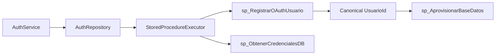

# Authentication Stored Procedures

The authentication module communicates with SQL Server only through stored procedures. The current repository contract invokes these procedures through `StoredProcedureExecutor`.

## `sp_RegistrarOAuthUsuario`

Called by `SQLServerRepository.register_oauth_user()`.

Input parameters:

- `Proveedor`
- `UsuarioExternoId`
- `Email`
- `Nombre`
- `AvatarUrl`
- `EmailVerificado`

Expected result row:

- `UsuarioId`, `UserId`, `user_id`, or `subject`
- optional `PrimerInicio`, `FirstLogin`, or `first_login`

SQL Server owns all decisions about existing users, new users, tenant state, and whether provisioning is required.

## `sp_AprovisionarBaseDatos`

Called by `AuthService.authenticate_oauth_user()` after `sp_RegistrarOAuthUsuario` returns the canonical subject. The service does not inspect `PrimerInicio` or decide whether provisioning is required; the stored procedure must remain idempotent and own that decision.

Input parameters:

- `UsuarioId`

## `sp_ObtenerCredencialesDB`

Exposed through `get_database_credentials()` and returns a sanitized key/value credential payload from the first result row. Callers must not log or expose returned credentials.

## Boundary

