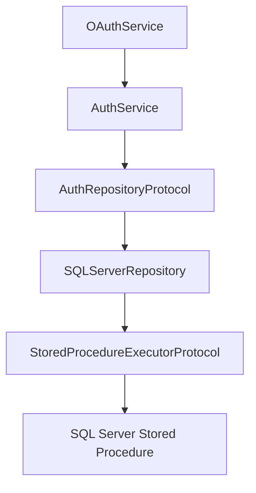

# Authentication Integration

## Scope

This document describes how the authentication package is intended to integrate with the shared database layer without changing the auth foundation.

## Current Shape

The authentication service remains responsible for:

- token issuance
- token validation
- OAuth orchestration boundary
- user DTO shaping

The repository boundary remains responsible for:

- registering provider-backed identities
- provisioning database resources
- reading credentials via stored procedures

## Integration Rule

The authentication repository should delegate persistence to a reusable SQL Server stored procedure executor rather than embed SQL or business logic in the auth package.

## Constraint

The current task intentionally does not implement provider callbacks or endpoint wiring. It only prepares the repository/database integration path so those flows can be connected later without architectural drift.
